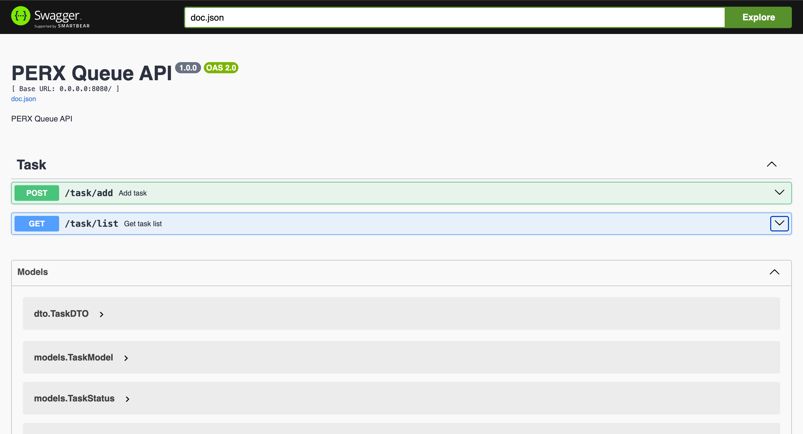

# PERX Queue API

## About
The service accepts tasks for calculating arithmetic progressions, queues them, and processes them in parallel with a specified number of workers. Each task is executed with real time intervals between iterations.

## Quick start

```bash
go run cmd/main.go [params]
```

### Launch options

---
`--workers`

Number of workers performing tasks (default: `workers=1`)

**Example:** `--workers=4`

---
`--logger-level`

Log display mode (default: `logger-level=local`)

**Available modes:** `local`, `dev`, `prod`

**Example:** `--logger-level=local`

---
`--host`

HTTP server host (default: `host=0.0.0.0`)

**Example:** `--host=127.0.0.1`

---
`--port`

HTTP server port (default: `port=8080`)

**Example:** `--port=8000`

---

## Swagger



### Access to swagger documentation is available at this link
[http://localhost:8080/swagger/index.html](http://localhost:8080/swagger/index.html)

> If you changed the host or port when running, replace them in the link address.